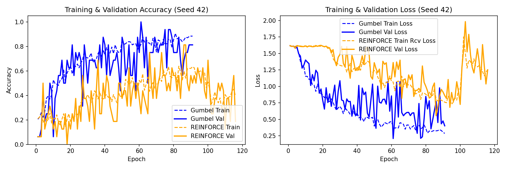
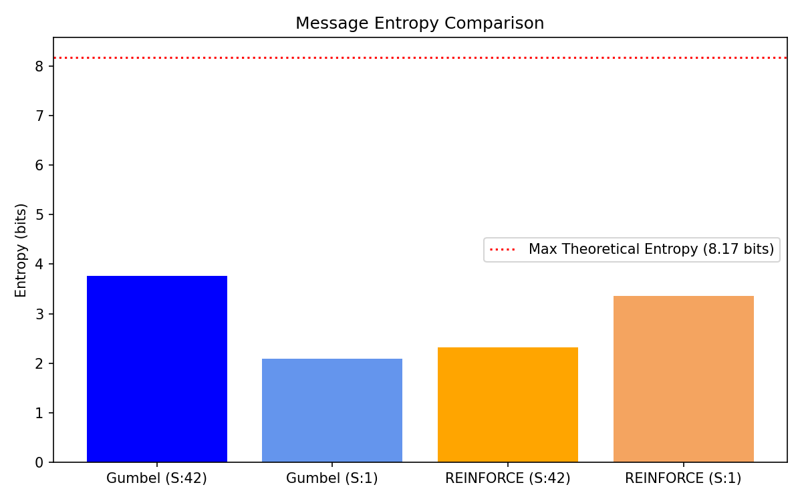
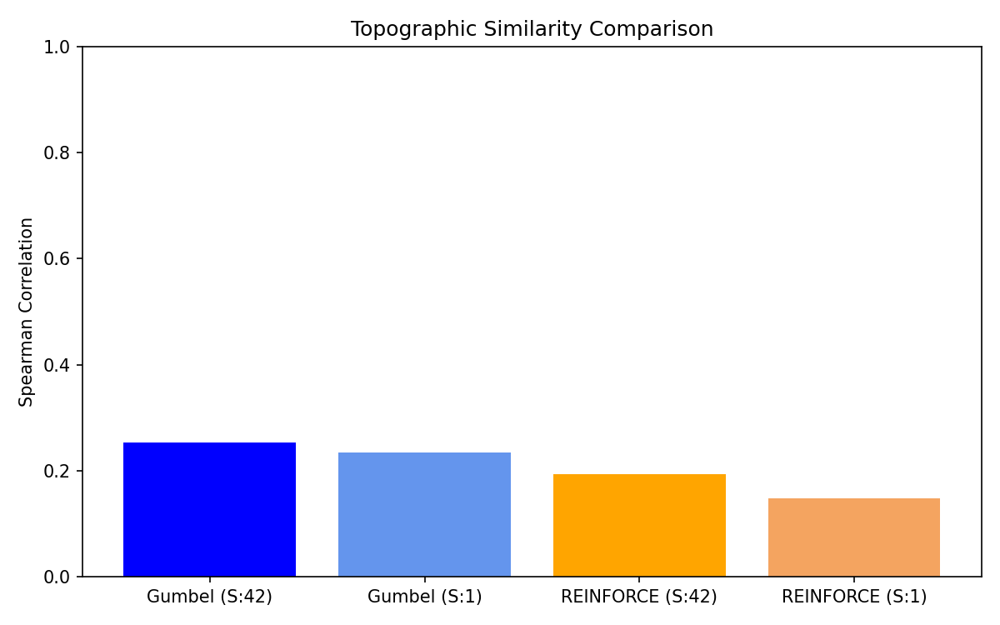

# Emergent Communication in a Referential Game


A PyTorch implementation of the referential game from **Havrylov & Titov, "Emergence of Language with Multi-agent Games: Learning to Communicate with Sequences of Symbols"** (NeurIPS 2017). [[paper]](https://arxiv.org/abs/1705.11192)

---

## Paper Replication

This project replicates the core communication game from the paper: two neural agents — a **Sender** and a **Receiver** — are trained jointly on a purely functional task (identifying the correct target among distractors), with no supervision on what their shared communication protocol should look like. A discrete symbolic "language" emerges from the training signal alone.

This implementation includes:
- The referential game environment (Sender/Receiver agents, synthetic concept data)
- Two training regimes: **Gumbel-Softmax** (differentiable relaxation) and **REINFORCE** (policy gradient), compared directly
- Post-training analysis of the emergent protocol: message entropy, topographic similarity, and per-symbol usage

---

## Overview

* **Sender**: observes a target concept (e.g. a `(shape, color, size)` tuple) and encodes it as a short sequence of discrete symbols.
* **Receiver**: reads the Sender's message and must pick the correct target out of a set of distractor concepts.
* **No explicit supervision on symbol meaning:** if the Receiver consistently picks correctly, a functioning communication protocol has emerged between them — this project measures how compositional and interpretable that protocol turns out to be.

---

## Project Structure

```
emergent-communication/
├── data/
│   └── synthetic_generator.py      # generates attribute-based concept tuples + distractor sets
├── src/
│   ├── sender.py                   # Sender agent: concept -> message
│   ├── receiver.py                 # Receiver agent: message -> target selection
│   ├── game.py                     # referential game loop / environment
│   ├── train_gumbel.py             # training via Gumbel-Softmax (differentiable)
│   ├── train_reinforce.py          # training via REINFORCE (policy gradient baseline)
│   └── metrics.py                  # entropy, topographic similarity, symbol-usage analysis
├── notebooks/
│   ├── analysis.ipynb              # loads training logs, produces final plots only
│   └── figures/                    # saved plot images, embedded in this README
├── configs/
│   └── default.yaml
├── requirements.txt
├── LICENSE
└── README.md
```

Training scripts log metrics to file (not notebook cell output); `notebooks/analysis.ipynb` only loads those logs and produces final plots, so it stays small and clean rather than filling with raw per-epoch dumps.

---

## Installation

```bash
git clone https://github.com/BeTechBo/emergent-communication-referential-game.git
cd emergent-communication-referential-game
pip install -r requirements.txt
```

## Usage

```bash
# generate synthetic concept dataset
python data/synthetic_generator.py --output data/concepts.pt

# train with Gumbel-Softmax
python src/train_gumbel.py --config configs/default.yaml

# train with REINFORCE (comparison)
python src/train_reinforce.py --config configs/default.yaml
```

Open `notebooks/analysis.ipynb` to reproduce the emergent-language analysis and plots.

---

## Results

| Method | Task Accuracy | Notes |
|---|---|---|
| Gumbel-Softmax | 93.75% (val) | differentiable, straight-through estimator; 288-concept space, early stopping at epoch 61 |
| REINFORCE | 81.25% (val) | discrete sampling + moving-average baseline; same dataset, early stopping at epoch 86 |

**Notes on training dynamics:** this task proved sensitive to batch size relative to dataset size — small batch counts per epoch (large batch size on a modest dataset) led to too few gradient updates and poor convergence, independent of model capacity or temperature settings. Reducing batch size to increase gradient steps per epoch was the key fix. We also found this architecture is sensitive to weight decay, which suppressed the sharp early representation shifts needed for the Sender/Receiver pair to break symmetry and establish a shared protocol. REINFORCE converged more slowly and to a lower final validation accuracy (81.25% vs. 93.75%) than Gumbel-Softmax on this run, consistent with the higher variance of the policy-gradient estimator relative to the differentiable relaxation — the Gumbel-Softmax method reached its best checkpoint in 61 epochs, while REINFORCE required 86. (See below: this accuracy gap did not hold up as a general ranking once a second seed was tested.)

---

## Emergent Language Analysis

| Metric | Gumbel-Softmax (seed 42) | Gumbel-Softmax (seed 1) | REINFORCE (seed 42) | REINFORCE (seed 1) |
|---|---|---|---|---|
| Val Accuracy | 93.75% | 75.00% | 81.25% | 87.50% |
| Message Entropy | 3.761 bits | 2.083 bits | 2.312 bits | 3.351 bits |
| Topographic Similarity | 0.253 | 0.233 | 0.193 | 0.148 |

Both training methods reliably solve the task (all four runs well above the 20% chance baseline) but consistently produce only weak-to-moderate compositionality — topographic similarity stayed in the 0.15–0.25 range across both methods and both seeds, well above 0 (random) but far below 1.0 (fully compositional), and no individual symbol was found to map cleanly onto a single concept attribute in any run. This is consistent with known findings in the emergent communication literature (e.g. Kottur et al. 2017, Chaabouni et al. 2020), where task success does not guarantee a human-interpretable, compositional code without additional pressure (e.g. population-based training, explicit compositionality regularization, or limited channel capacity), none of which are included in this implementation.

Task accuracy and message entropy varied substantially by seed for both methods (e.g. Gumbel-Softmax ranged 75–93.75% accuracy across two seeds), so no reliable accuracy or entropy ranking between the two training methods can be claimed from this many runs. Topographic similarity was the one metric that consistently favored Gumbel-Softmax across both seeds (0.253 vs 0.193, and 0.233 vs 0.148), a weak signal worth further investigation with more seeds, but not treated here as a strong conclusion.

### Plots

**Training curves (seed 42):**

*Both methods reach their best validation performance mid-run — Gumbel-Softmax at epoch 61, REINFORCE at epoch 86 — before visibly degrading in later epochs. All reported results use the checkpoint saved at each method's best epoch, not the final epoch; early stopping correctly restored these earlier checkpoints rather than the noisy late-run state shown at the right edge of the plot.*

**Message entropy across seeds:**

*All four runs sit well below the theoretical maximum entropy (8.17 bits) for this vocabulary/message length, meaning none of the models degenerated into sending fully random, uninformative messages. Entropy varies more by seed than by training method — compare Gumbel-Softmax seed 42 (3.76 bits) against Gumbel-Softmax seed 1 (2.08 bits) — which is why entropy is not used here to rank Gumbel-Softmax against REINFORCE.*

**Topographic similarity across seeds:**

*This is the one metric that ordered consistently by method rather than by seed: both Gumbel-Softmax runs (0.253, 0.233) sit above both REINFORCE runs (0.193, 0.148). All four bars are still well below 1.0, reinforcing the "weak-to-moderate compositionality" conclusion above — the protocol is more compositional than chance, but not cleanly interpretable at the level of individual symbols.*

---

## Design Limitations & Future Work

* **Seed sensitivity:** this signaling-game setup showed meaningful run-to-run variance in accuracy and entropy across seeds; results here are based on two seeds per method, not averaged across a larger sweep.
* **No compositionality pressure:** the setup follows the base referential game from the paper, without additional mechanisms known to encourage compositionality (population-based training, explicit regularization, limited channel capacity).
* **Small-scale synthetic data:** concepts are generated from a fixed synthetic attribute space (288 concepts, 3 attributes) rather than naturalistic or learned visual inputs.

---

## References

* Havrylov, S. & Titov, I. (2017). [Emergence of Language with Multi-agent Games: Learning to Communicate with Sequences of Symbols](https://arxiv.org/abs/1705.11192). NeurIPS 2017.
* Kottur, S. et al. (2017). Natural Language Does Not Emerge 'Naturally' in Multi-Agent Dialog.
* Chaabouni, R. et al. (2020). Compositionality and Generalization in Emergent Languages.

---

## License

MIT — see [LICENSE](LICENSE).
